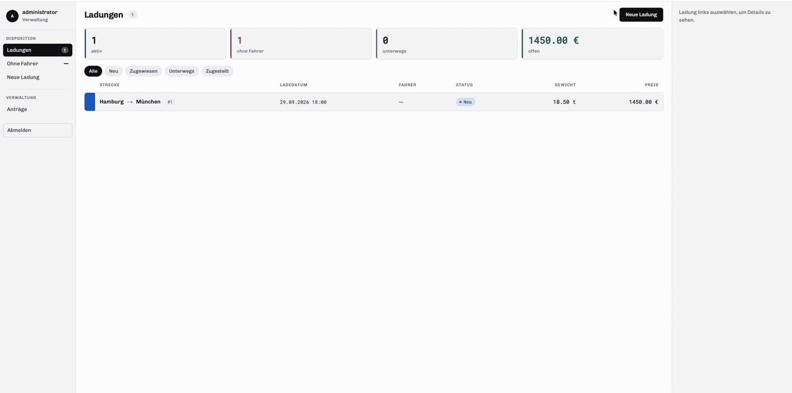
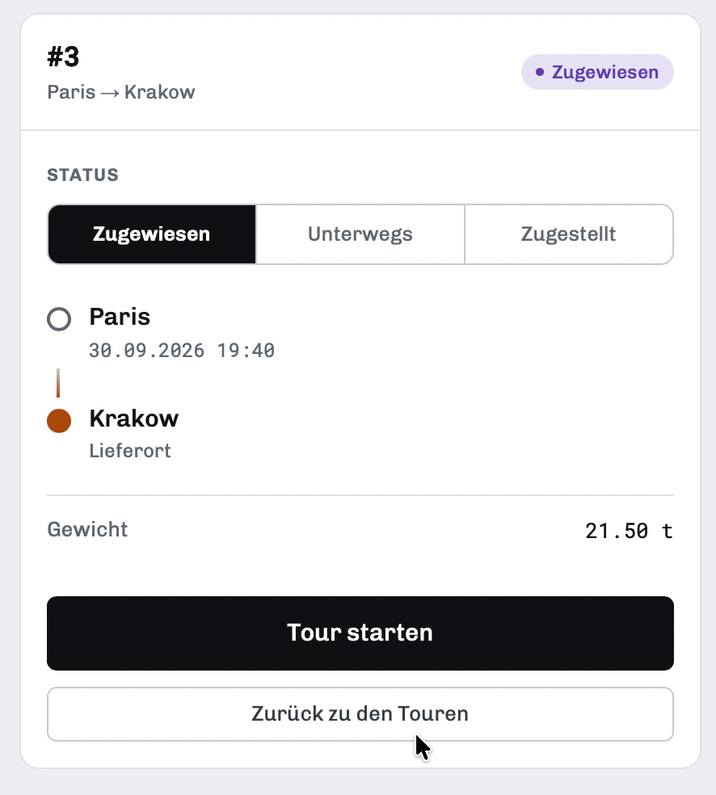

# Dispo

Freight dispatch app — dispatchers create loads, assign them to drivers and track them through delivery.
German UI, two roles: **Disponent** (dispatcher) and **Fahrer** (driver).

Learning project. The backend is written by hand; most of the frontend screens were built with AI assistance.

| Disponent | Fahrer |
|---|---|
|  |  |

## Tech Stack

FastAPI · PostgreSQL · asyncpg · JWT · vanilla JS (no framework, no build step)

## Getting Started

### Backend — Docker Compose (recommended)

Needs [Docker](https://docs.docker.com/get-docker/). Python and Postgres on the host are **not** required.

```bash
git clone https://github.com/ilyavzane/Dispo.git
cd Dispo/backend
cp .env.example .env      # fill in POSTGRES_PASSWORD, JWT_SECRET, ADMIN_PASSWORD
docker compose up --build
```

This starts two containers:

| Service | What it does | Port on your machine |
|---|---|---|
| `db` | Postgres 17. Creates the `POSTGRES_DB` database and runs `migrations/*.sql` automatically | `5433` |
| `app` | FastAPI backend, connects to `db` inside the Docker network | `8000` |

Check it: http://localhost:8000/health

Create the admin account (optional):

```bash
docker compose exec app python -m scripts.seed
```

Useful commands:

```bash
docker compose up -d --build    # run in the background
docker compose logs -f app      # follow the backend logs
docker compose down             # stop, data is kept in the db_data volume
docker compose down -v          # stop and DELETE the database volume
```

⚠️ Migrations in `migrations/` run **only when the volume is empty** (first start).
If you change them or want a fresh database, run `docker compose down -v` and start again.

To open the database in pgAdmin/psql: host `localhost`, port `5433`, user and password from `.env`.

### Backend — without Docker

Needs Python 3.13 and a local Postgres (usually on port `5432`).

```bash
cd Dispo/backend
python -m venv venv && source venv/bin/activate
pip install -r requirements.txt
cp .env.example .env      # set DATABASE_URL to your local Postgres (port 5432)
createdb -U postgres dispo
psql -U postgres -d dispo -f migrations/001_create_users.sql
psql -U postgres -d dispo -f migrations/002_create_loads.sql
psql -U postgres -d dispo -f migrations/003_create_indexes.sql
uvicorn app.main:app --reload
```

Optional admin account: `python -m scripts.seed`

### Frontend

Static files, no build. Serve `frontend/` over HTTP — opening the files directly via
`file://` will not work, because the scripts are ES modules.

```bash
cd ../frontend
python -m http.server 5500
```

Then open http://127.0.0.1:5500/index.html

The API base URL is chosen in `frontend/js/app.js` (`API`) by hostname: on `localhost` /
`127.0.0.1` it calls `http://127.0.0.1:8000`, anywhere else the deployed backend on Render.
The origin you serve the frontend from must be listed in `CORS_ORIGINS`.

## Environment Variables

| Variable | Meaning |
|---|---|
| `POSTGRES_USER`, `POSTGRES_PASSWORD`, `POSTGRES_DB` | Docker Compose: credentials and name of the database the `db` container creates |
| `DATABASE_URL` | Postgres connection string. Used without Docker; in Compose the `app` container gets its own, built from `POSTGRES_*` |
| `TEST_DATABASE_URL` | Separate database for `pytest`; its name must contain `test` |
| `JWT_SECRET` | Secret for signing tokens — required, app refuses to start without it |
| `JWT_ALGORITHM` | Signing algorithm, e.g. `HS256` |
| `ACCESS_TOKEN_EXPIRE_MINUTES` | Token lifetime, default `60` |
| `CORS_ORIGINS` | Comma-separated list of allowed frontend origins |
| `ADMIN_EMAIL`, `ADMIN_PASSWORD` | Credentials for the seeded admin account |

## Tests

Tests run on the host against a separate database named `dispo_test`. With the Docker database (port `5433`):

```bash
cd backend
python -m venv venv && source venv/bin/activate
pip install -r requirements.txt -r requirements-dev.txt
docker compose up -d db_test     # test Postgres on port 5434, fresh on every start
pytest
```

Stop the test database: docker compose stop db_test.

The database only needs to be created once. Tests refuse to run if `TEST_DATABASE_URL` does not contain `test`.

## API

Interactive docs: http://localhost:8000/docs

| Method | Path | Role |
|---|---|---|
| `GET` | `/health` | — |
| `POST` | `/auth/register` | — |
| `POST` | `/auth/login` | — |
| `GET` | `/me` | Disponent, Fahrer |
| `GET` | `/users?status=` | Admin |
| `PATCH` | `/users/{id}/status` | Admin |
| `GET` | `/drivers?available=` | Disponent |
| `GET` | `/loads?status=` | Disponent, Fahrer |
| `GET` | `/loads/{id}` | Disponent, Fahrer |
| `POST` | `/loads` | Disponent |
| `PATCH` | `/loads/{id}` | Disponent |
| `PATCH` | `/loads/{id}/assign` | Disponent |
| `PATCH` | `/loads/{id}/status` | Fahrer |

Admin passes every role check. Drivers only see loads assigned to them.

Load status flow: `new → assigned → in_transit → delivered`

New accounts start as `pending` and must be approved by an admin before they can log in.

## Status — v0.1

**Done**

- Backend: auth, roles, account approval, load CRUD, driver assignment, status transitions, tests
- Frontend: login (redirects by role), registration, pending screen
- Dispatcher: load board — table, KPIs, detail panel, status filters, edit dialog (`PATCH`)
- Dispatcher: create load (`POST /loads`) with live preview
- Dispatcher: driver assignment — unassigned loads, `Frei / Alle` driver filter, `PATCH /loads/{id}/assign`
- Admin: account approval queue (`PATCH /users/{id}/status`)
- Driver: mobile screen with own tours and status updates (`PATCH /loads/{id}/status`)
- Docker: `docker compose` runs backend + Postgres, migrations applied on first start
- Deployment: backend on Render, database on Neon
